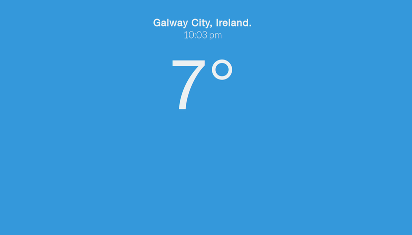

Weather-Page
=======================================

Weather-Page (my project names are nothing if not original) is a html + js + sass page for displaying the 
current temperature. I made this to replace the default tab page for firefox and to play with
openweatherapi.

Caveat emptor! A future release may find out your current location 
using the ```<geo>``` html5 tag, to give you weather for your current location. This 
**will not** be stored or sent to a remote location or sinister three-letter agency. You will be 
prompted to allow this each time, by your browser itself.

## 1 Installation

## 2 Screenshots

</img>

## 3 License

MIT license
